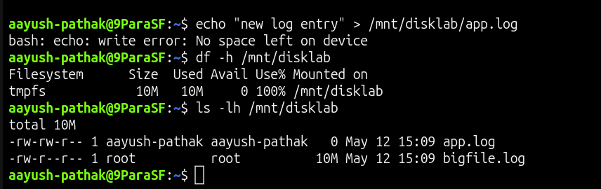
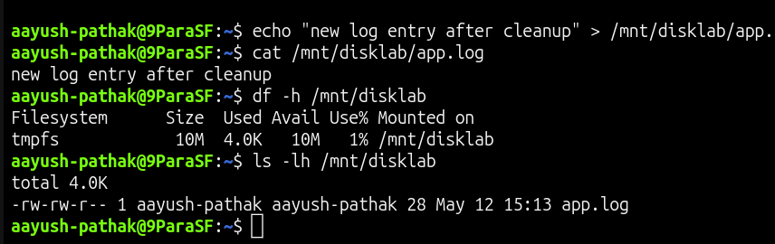

# Disk Space Full

## Incident Summary

The application was unable to write new log entries because the application filesystem became full.

---

## 🔴 Impact

- Application log writes failed
- New files could not be created in the application path
- Disk usage reached 100%
- Application troubleshooting was blocked until space was recovered

---

## 🧪 Symptom

Command used to write a new log entry:

```bash
echo "new log entry" > /mnt/disklab/app.log
```

Failure output:

```text
bash: /mnt/disklab/app.log: No space left on device
```

---

## 🖼️ Screenshot - Disk Space Full



---

## 🔍 Investigation

Checked filesystem usage:

```bash
df -h /mnt/disklab
```

The application filesystem was showing 100% usage.

Checked which files were using space:

```bash
ls -lh /mnt/disklab
```

Checked total usage of the application mount point:

```bash
du -sh /mnt/disklab
```

A large test log file was consuming the available disk space.

---

## 🎯 Root Cause

The `/mnt/disklab` filesystem was full because a large test file consumed almost all available space.

---

## ✅ Fix Applied

Removed the large unwanted file:

```bash
rm /mnt/disklab/bigfile.log
```

---

## ✅ Verification

Checked disk usage again:

```bash
df -h /mnt/disklab
```

Verified that the application could write a new log entry:

```bash
echo "new log entry after cleanup" > /mnt/disklab/app.log
cat /mnt/disklab/app.log
```

Expected result:

```text
new log entry after cleanup
```

---

## 🖼️ Screenshot - Disk Space Fixed



---

## 🧰 Commands Used

```bash
df -h /mnt/disklab
ls -lh /mnt/disklab
du -sh /mnt/disklab
rm /mnt/disklab/bigfile.log
echo "new log entry after cleanup" > /mnt/disklab/app.log
cat /mnt/disklab/app.log
```

---

## 🧠 Key Learning

- A full filesystem can stop applications from writing logs or creating files
- `df -h` quickly confirms disk usage at the filesystem level
- `ls -lh` and `du -sh` help identify where space is being used
- Removing unwanted large files should be followed by verification
- Always confirm the application can write again after cleanup

---

## Final Result

Disk space was recovered and the application was able to write logs again.

```text
new log entry after cleanup
```
