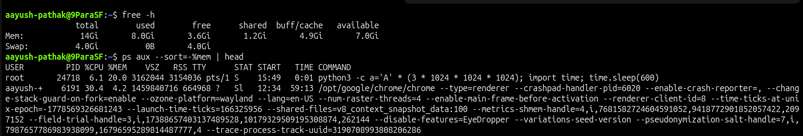
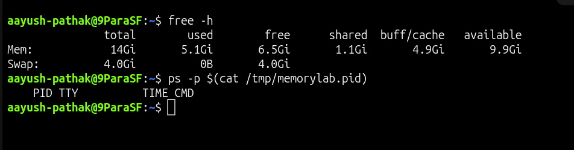

# Memory Usage High

## Incident Summary

The server became slow because one process was consuming a large amount of memory.

---

## 🔴 Impact

- Server response became slow
- Application commands took longer than usual
- Available memory was low
- Other processes could have been affected if memory pressure continued

---

## 🧪 Symptom

Memory usage was checked with `free -h`.

```bash
free -h
```

Example issue seen:

```text
available memory was low and used memory was high
```

The process list showed a memory-heavy process running on the server.

```bash
ps aux --sort=-%mem | head
```

---

## 🖼️ Screenshot - Memory Usage High



---

## 🔍 Investigation

Checked current memory usage:

```bash
free -h
```

Checked which process was using the most memory:

```bash
ps aux --sort=-%mem | head
```

Checked the lab process PID:

```bash
cat /tmp/memorylab.pid
```

The output showed a `python3` process using high memory.

---

## 🎯 Root Cause

A test `python3` process was consuming a large amount of memory and reducing available memory on the server.

---

## ✅ Fix Applied

Stopped the high-memory process using its saved PID.

```bash
kill $(cat /tmp/memorylab.pid)
```

---

## ✅ Verification

Checked memory again:

```bash
free -h
```

Confirmed the high-memory process was no longer running:

```bash
ps -p $(cat /tmp/memorylab.pid)
```

Expected result:

```text
Only the header is shown, or no running process is listed for that PID.
```

---

## 🖼️ Screenshot - Memory Usage Fixed



---

## 🧰 Commands Used

```bash
free -h
ps aux --sort=-%mem | head
cat /tmp/memorylab.pid
kill $(cat /tmp/memorylab.pid)
ps -p $(cat /tmp/memorylab.pid)
rm -f /tmp/memorylab.pid
```

---

## 🧠 Key Learning

- High memory usage can make the server slow even when the service is still running
- `free -h` gives a quick memory summary
- `ps aux --sort=-%mem | head` helps identify memory-heavy processes
- Always confirm the process before stopping it
- Verify memory recovery after applying the fix

---

## Final Result

The high-memory process was stopped successfully, and memory availability improved after verification.

```text
free -h showed improved available memory after stopping the high-memory process.
```
