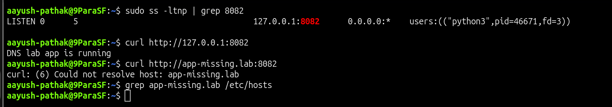

# DNS Hosts Missing Host Entry

## Incident Summary

An internal application was running locally, but the application hostname did not work because the `/etc/hosts` entry was missing.

---

## 🔴 Impact

- Application was reachable by IP address
- Hostname-based access failed
- Users could not access the service using the expected internal name
- Application looked down even though the process was running

---

## 🧪 Symptom

The application worked by IP address:

```bash
curl http://127.0.0.1:8082
```

Expected output:

```text
DNS lab app is running
```

But the hostname failed:

```bash
curl http://app-missing.lab:8082
```

Error:

```text
curl: (6) Could not resolve host: app-missing.lab
```

---

## 🖼️ Screenshot - Missing Hosts Entry



---

## 🔍 Investigation

The application port was listening locally:

```bash
ss -ltnp | grep 8082
```

The IP address worked:

```bash
curl http://127.0.0.1:8082
```

The hostname failed:

```bash
curl http://app-missing.lab:8082
```

The hosts file did not have an entry for the application hostname:

```bash
grep app-missing.lab /etc/hosts
```

No output was returned, which confirmed the host entry was missing.

---

## 🎯 Root Cause

The application hostname `app-missing.lab` was not present in `/etc/hosts`.

Because of this, the system could not resolve the hostname to `127.0.0.1`.

---

## ✅ Fix Applied

Added the missing hostname entry in `/etc/hosts`:

```bash
echo '127.0.0.1 app-missing.lab' | sudo tee -a /etc/hosts
```

---

## ✅ Verification

The hostname resolved correctly after adding the hosts entry:

```bash
curl http://app-missing.lab:8082
```

Expected output:

```text
DNS lab app is running
```

The hosts entry was also confirmed:

```bash
grep app-missing.lab /etc/hosts
```

Expected output:

```text
127.0.0.1 app-missing.lab
```

---

## 🖼️ Screenshot - Hostname Fixed


---

## 🧰 Commands Used

```bash
ss -ltnp | grep 8082
curl http://127.0.0.1:8082
curl http://app-missing.lab:8082
grep app-missing.lab /etc/hosts
echo '127.0.0.1 app-missing.lab' | sudo tee -a /etc/hosts
```

---

## 🧠 Key Learning

- A service can be running even when hostname access fails
- Testing by IP helps separate application issues from DNS or hosts file issues
- `/etc/hosts` is often used for simple local hostname mapping
- Missing host entries can cause simple name resolution failures

---

## Final Result

The missing hosts entry was added and hostname access worked successfully:

```text
DNS lab app is running
```
