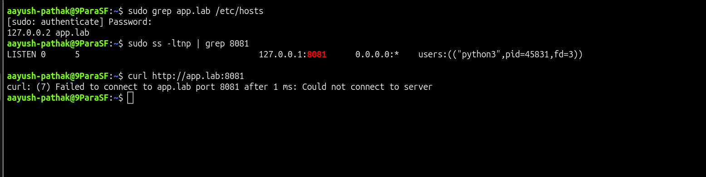

# DNS / Hosts Wrong IP Entry

## Incident Summary

A local app hostname pointed to the wrong IP in `/etc/hosts`, so the app did not open in the browser.

---

## 🔴 Impact

- The hostname did not reach the local service.
- Users could not open the app using the name.
- The service itself was running, but name resolution was wrong.

---

## 🧪 Symptom

```bash
curl http://app.lab:8081
```

Expected failure:

```text
curl: (7) Failed to connect to app.lab port 8081
```

---

## 🖼️ Screenshot - DNS Issue



---

## 🔍 Investigation

```bash
grep app.lab /etc/hosts
ss -ltnp | grep 8081
```

The app was listening on port `8081`, but `app.lab` was mapped to the wrong IP in `/etc/hosts`.

---

## 🎯 Root Cause

`app.lab` pointed to `127.0.0.2` instead of `127.0.0.1`.

---

## ✅ Fix Applied

```bash
sudo sed -i '/app.lab/d' /etc/hosts

echo '127.0.0.1 app.lab' | sudo tee -a /etc/hosts
```

---

## ✅ Verification

```bash
curl http://app.lab:8081
```

Expected result:

```text
DNS lab app is running
```

---

## 🖼️ Screenshot - Issue Fixed


---

## 🧰 Commands Used

```bash
python3 -m http.server --bind 127.0.0.1 --directory /tmp/dnslab 8081
curl http://app.lab:8081
grep app.lab /etc/hosts
ss -ltnp | grep 8081
sudo sed -i '/app.lab/d' /etc/hosts
echo '127.0.0.1 app.lab' | sudo tee -a /etc/hosts
```

---

## 🧠 Key Learning

- A service can be healthy but still fail by name if `/etc/hosts` is wrong.
- Checking the hosts file is a quick first step.
- A simple local hostname test is enough for a production-style lab.

---

## Final Result

The hostname now resolves to the correct local IP, and the app opens successfully with:

```text
DNS lab app is running
```
