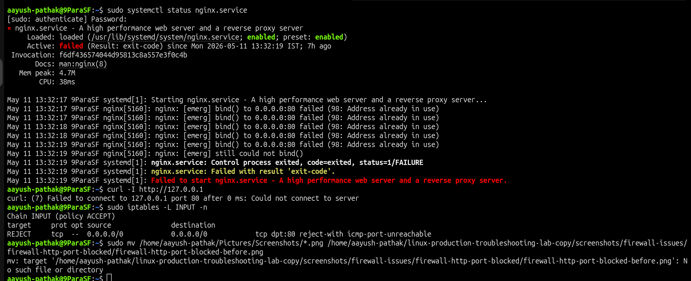
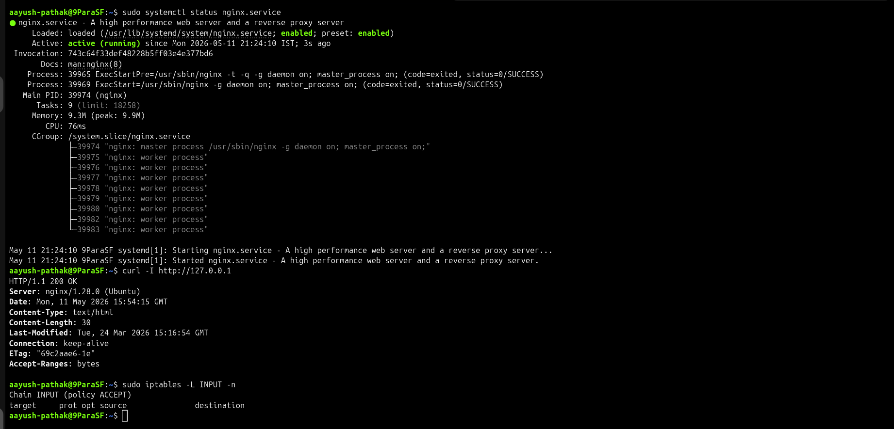

# 🔥 Firewall HTTP Port 80 Blocked

## Incident Summary

Nginx was running, but HTTP access on port `80` was blocked.

The service was active and the web port was listening, but the request did not reach the application because a firewall rule was rejecting HTTP traffic.

This issue demonstrates how to troubleshoot a web access failure by checking the service state, listening port, HTTP response, and firewall rules.

---

## 🔴 Impact

- HTTP access failed on port `80`
- Nginx service was running
- Port `80` was listening
- Website response was not available
- Issue was caused by a firewall rule blocking HTTP traffic

---

## 🧪 Symptom

HTTP request to the local web server failed:

    curl -I http://127.0.0.1

Nginx was still active:

    systemctl is-active nginx

Port `80` was also listening:

    ss -tulnp | grep :80

This showed that the service was not down. The issue was happening after the service and port checks.

---

## 🖼️ Screenshot - HTTP Request Failed

---

## 🔍 Investigation

Checked Nginx service status:

    systemctl is-active nginx

The service was active.

Checked whether port `80` was listening:

    ss -tulnp | grep :80

Nginx was listening on port `80`.

Tested local HTTP access:

    curl -I http://127.0.0.1

The HTTP request failed even though the service was running.

Checked firewall rules:

    sudo iptables -L INPUT -n

A rule was present that rejected TCP traffic on port `80`.

---

## 🎯 Root Cause

The root cause was a firewall rule rejecting HTTP traffic on port `80`.

Nginx was active and the port was listening, but the firewall rule blocked the request before it could complete successfully.

This was not a Nginx service issue, configuration issue, or port binding issue.

---

## ✅ Fix Applied

Removed the firewall rule blocking HTTP port `80`:

    sudo iptables -D INPUT -p tcp --dport 80 -j REJECT

Tested the web response again:

    curl -I http://127.0.0.1

---

## ✅ Verification

Verified Nginx service status:

    systemctl is-active nginx

Verified port `80` was listening:

    ss -tulnp | grep :80

Verified HTTP response:

    curl -I http://127.0.0.1

Successful response:

    HTTP/1.1 200 OK
    Server: nginx

---

## 🖼️ Screenshot - HTTP Access Restored

---

## 🧰 Commands Used

Block HTTP port `80` for lab scenario:

    sudo iptables -I INPUT -p tcp --dport 80 -j REJECT

Check Nginx service:

    systemctl is-active nginx

Check port `80`:

    ss -tulnp | grep :80

Test HTTP access:

    curl -I http://127.0.0.1

Check firewall rules:

    sudo iptables -L INPUT -n

Remove firewall block:

    sudo iptables -D INPUT -p tcp --dport 80 -j REJECT

Verify HTTP response:

    curl -I http://127.0.0.1

---

## 🧠 Key Learning

When a web service is not reachable, first confirm that the service is running and the port is listening.

If both are correct but the request still fails, check firewall rules.

For firewall-related web access issues, always check:

- service status
- listening port
- HTTP response
- firewall rules
- final HTTP verification

---

## Final Result

HTTP access was restored after removing the firewall rule blocking port `80`.

Final verification:

    HTTP/1.1 200 OK
