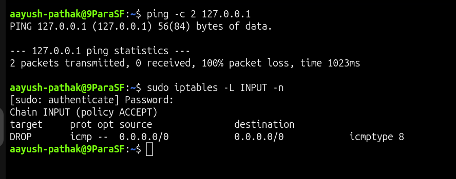
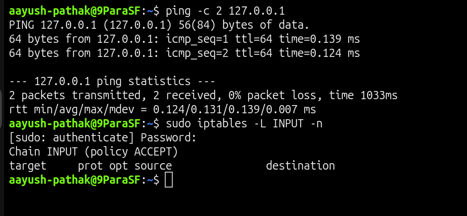

# 🔥 Firewall ICMP Ping Blocked

## Incident Summary

Ping to the server was failing, but the server itself was not down.

The firewall had a rule that blocked ICMP echo request traffic, so ping requests were dropped.

This issue demonstrates how to troubleshoot a network reachability problem where ICMP is blocked by firewall rules.

---

## 🔴 Impact

- Ping test failed
- Basic network reachability check looked broken
- Server could still be running normally
- ICMP traffic was blocked by firewall
- Issue was caused by a firewall rule, not by server downtime

---

## 🧪 Symptom

Ping failed while testing the local server:

    ping -c 2 127.0.0.1

The request did not get a normal ping response.

Firewall rules were checked:

    sudo iptables -L INPUT -n

The firewall had a rule blocking ICMP echo request traffic.

---

## 🖼️ Screenshot - Ping Blocked

---

## 🔍 Investigation

Tested ping:

    ping -c 2 127.0.0.1

Ping failed.

Checked firewall rules:

    sudo iptables -L INPUT -n

A rule was present that dropped ICMP echo request traffic.

This showed that ping was failing because ICMP traffic was blocked by the firewall.

---

## 🎯 Root Cause

The root cause was a firewall rule blocking ICMP echo request traffic.

Ping uses ICMP, and the firewall was dropping those packets.

This was not a server crash, service issue, or DNS issue.

---

## ✅ Fix Applied

Removed the firewall rule blocking ICMP echo request traffic:

    sudo iptables -D INPUT -p icmp --icmp-type echo-request -j DROP

Tested ping again:

    ping -c 2 127.0.0.1

---

## ✅ Verification

Verified ping response:

    ping -c 2 127.0.0.1

Successful result:

    2 packets transmitted, 2 received, 0% packet loss

Checked firewall rules again:

    sudo iptables -L INPUT -n

The blocking ICMP rule was removed.

---

## 🖼️ Screenshot - Ping Restored

---

## 🧰 Commands Used

Block ICMP ping for lab scenario:

    sudo iptables -I INPUT -p icmp --icmp-type echo-request -j DROP

Test ping during issue:

    ping -c 2 127.0.0.1

Check firewall rules:

    sudo iptables -L INPUT -n

Remove ICMP block:

    sudo iptables -D INPUT -p icmp --icmp-type echo-request -j DROP

Verify ping after fix:

    ping -c 2 127.0.0.1

---

## 🧠 Key Learning

Ping failure does not always mean the server is down.

Ping uses ICMP, and ICMP can be blocked by firewall rules.

For ping-related firewall issues, always check:

- ping result
- firewall rules
- ICMP block rules
- final ping verification

---

## Final Result

Ping started working after removing the firewall rule blocking ICMP echo request traffic.

Final verification:

    2 packets transmitted, 2 received, 0% packet loss
