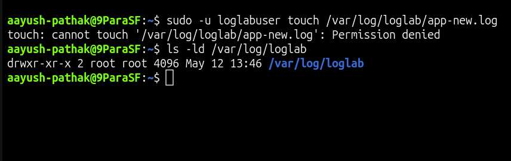
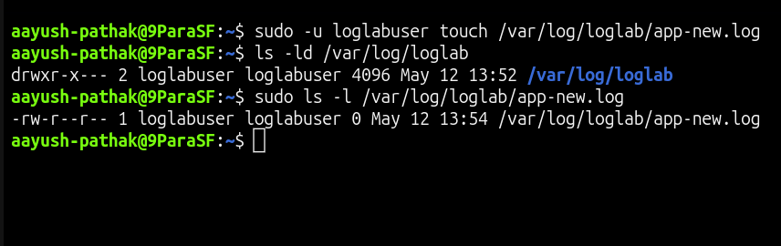

# 📜 Log Directory Write Permission Denied

## Incident Summary

The log directory existed, but the application user could not create a new log file inside it.

The issue was caused by incorrect ownership on the log directory:

    /var/log/loglab

The directory was owned by `root`, so the application user did not have write permission to create log files.

---

## 🔴 Impact

- Application user could not create new log files
- Log writing failed with permission denied
- New application activity was not captured in logs
- The log directory existed, but the expected user could not write to it
- Issue was caused by directory ownership, not by missing disk space

---

## 🧪 Symptom

Tried to create a new log file as the application user:

    sudo -u loglabuser touch /var/log/loglab/app-new.log

Observed error:

    touch: cannot touch '/var/log/loglab/app-new.log': Permission denied

This confirmed that the application user could not write inside the log directory.

---

## 🖼️ Screenshot - Log Directory Write Denied

---

## 🔍 Investigation

Checked the log directory permission:

    ls -ld /var/log/loglab

The directory was owned by `root`:

    drwxr-xr-x root root

This means only the directory owner had write permission.

Since the application user was not the owner, it could not create a new log file inside the directory.

---

## 🎯 Root Cause

The root cause was incorrect ownership on the log directory.

The directory was owned by:

    root:root

Because of this, the application user `loglabuser` did not have write permission inside:

    /var/log/loglab

This caused log file creation to fail with:

    Permission denied

---

## ✅ Fix Applied

Changed the log directory ownership to the application user:

    sudo chown loglabuser:loglabuser /var/log/loglab

Applied safe directory permission:

    sudo chmod 750 /var/log/loglab

Verified the updated directory permission:

    sudo ls -ld /var/log/loglab

Expected result:

    drwxr-x---

---

## ✅ Verification

Retested log file creation as the application user:

    sudo -u loglabuser touch /var/log/loglab/app-new.log

Checked the created file as the application user:

    sudo -u loglabuser ls -l /var/log/loglab/app-new.log

Checked the directory permission:

    sudo ls -ld /var/log/loglab

This confirmed that the application user could create log files successfully.

---

## 🖼️ Screenshot - Log Directory Write Fixed

---

## 🧰 Commands Used

Create lab user:

    sudo useradd -m loglabuser

Create log directory:

    sudo mkdir -p /var/log/loglab

Create the issue:

    sudo rm -f /var/log/loglab/app-new.log
    sudo chown root:root /var/log/loglab
    sudo chmod 755 /var/log/loglab

Test log file creation as application user:

    sudo -u loglabuser touch /var/log/loglab/app-new.log

Check log directory permission:

    ls -ld /var/log/loglab

Fix log directory ownership:

    sudo chown loglabuser:loglabuser /var/log/loglab

Fix log directory permission:

    sudo chmod 750 /var/log/loglab

Verify log file creation:

    sudo -u loglabuser touch /var/log/loglab/app-new.log

Check created log file:

    sudo -u loglabuser ls -l /var/log/loglab/app-new.log

Check fixed directory permission:

    sudo ls -ld /var/log/loglab

---

## 🧠 Key Learning

A directory needs write permission for a user to create files inside it.

Even if the directory exists, log writing can fail when the application user does not own the directory or does not have write access.

When troubleshooting log write issues, always check:

- log directory path
- directory ownership
- directory permission
- application user access
- whether the issue is file-level or directory-level

Avoid using unsafe permissions like `777`.

Fix the owner and apply only the permission needed for the application user.

---

## Final Result

The issue was resolved after correcting ownership and permission on `/var/log/loglab`.

Final verification:

    sudo -u loglabuser ls -l /var/log/loglab/app-new.log
