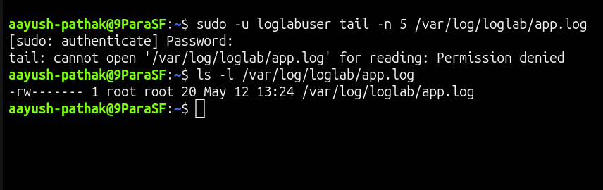
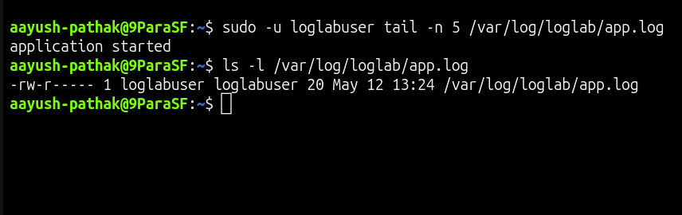

# 📜 Log File Permission Denied

## Incident Summary

The application log file existed, but the application user could not read it.

The issue was caused by incorrect ownership and restrictive permission on the log file:

    /var/log/loglab/app.log

The log directory was reachable, but the log file itself was owned by `root` and allowed read access only to the owner.

---

## 🔴 Impact

- Application logs were not readable by the application user
- Troubleshooting was blocked because logs could not be checked
- The log file existed, but access was denied
- Issue was caused by file permission, not by missing logs
- Root user could read the file, but the application user could not

---

## 🧪 Symptom

Tried to read the application log as the application user:

    sudo -u loglabuser tail -n 5 /var/log/loglab/app.log

Observed error:

    tail: cannot open '/var/log/loglab/app.log' for reading: Permission denied

This confirmed that the log file existed, but the expected user did not have permission to read it.

---

## 🖼️ Screenshot - Log File Permission Denied

---

## 🔍 Investigation

Checked the log directory permission:

    ls -ld /var/log/loglab

The directory was accessible.

Checked the log file permission:

    ls -l /var/log/loglab/app.log

The log file was owned by `root` and had restrictive permission:

    -rw-------

This means only the file owner could read and write the log file.

Since the application user was not the owner and did not have group or other read permission, access failed with:

    Permission denied

---

## 🎯 Root Cause

The root cause was incorrect ownership and permission on the log file.

The file was owned by:

    root:root

And the permission was:

    600

Because of this, only root could read the file.

The application user `loglabuser` could not read `/var/log/loglab/app.log`.

---

## ✅ Fix Applied

Changed the log file ownership to the application user:

    sudo chown loglabuser:loglabuser /var/log/loglab/app.log

Applied safe log file permission:

    sudo chmod 640 /var/log/loglab/app.log

Verified the updated permission:

    ls -l /var/log/loglab/app.log

Expected result:

    -rw-r-----

---

## ✅ Verification

Retested log access as the application user:

    sudo -u loglabuser tail -n 5 /var/log/loglab/app.log

Successful result:

    application started

This confirmed that the application user could read the log file successfully.

---

## 🖼️ Screenshot - Log File Access Fixed

---

## 🧰 Commands Used

Create lab user:

    sudo useradd -m loglabuser

Create log directory:

    sudo mkdir -p /var/log/loglab

Create sample log file:

    echo "application started" | sudo tee /var/log/loglab/app.log

Create the issue:

    sudo chown root:root /var/log/loglab/app.log
    sudo chmod 600 /var/log/loglab/app.log

Test log access as application user:

    sudo -u loglabuser tail -n 5 /var/log/loglab/app.log

Check log directory permission:

    ls -ld /var/log/loglab

Check log file permission:

    ls -l /var/log/loglab/app.log

Fix log file ownership:

    sudo chown loglabuser:loglabuser /var/log/loglab/app.log

Fix log file permission:

    sudo chmod 640 /var/log/loglab/app.log

Verify log access:

    sudo -u loglabuser tail -n 5 /var/log/loglab/app.log

---

## 🧠 Key Learning

A log file can exist but still be unreadable because of incorrect file permissions.

When troubleshooting log access issues, always check:

- log file path
- log directory permission
- log file owner
- log file group
- log file permission
- the user trying to read the log

Avoid using unsafe permissions like `777`.

Use ownership and minimum required permission to fix the issue safely.

---

## Final Result

The issue was resolved after correcting ownership and permission on `/var/log/loglab/app.log`.

Final verification:

    application started
