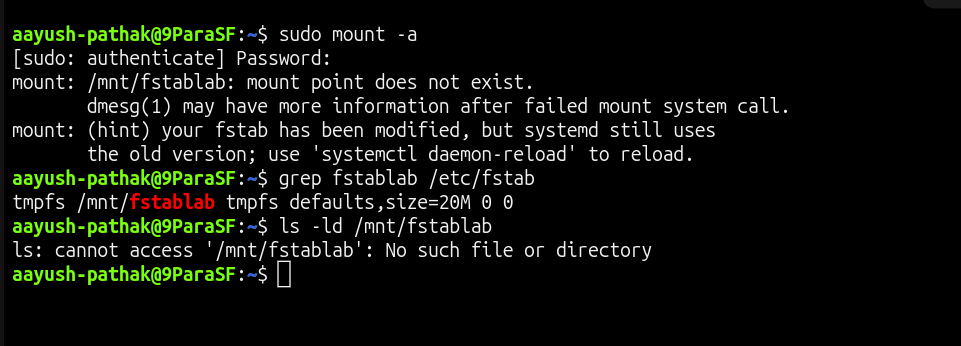
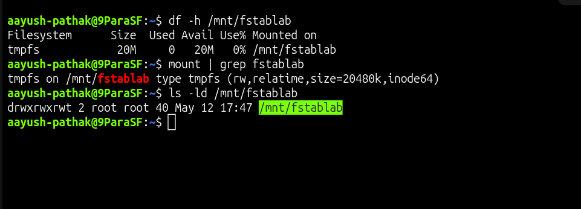

# Fstab Mount Point Missing

## Incident Summary

A server failed to mount a filesystem from `/etc/fstab` because the mount point directory was missing.

---

## 🔴 Impact

- Filesystem did not mount during validation
- Application path was not available
- `mount -a` returned an error
- Manual verification was required before closing the incident

---

## 🧪 Symptom

The mount command failed while reading the fstab entry.

```bash
sudo mount -a
```

Example error:

```text
mount: /mnt/fstablab: mount point does not exist.
```

---

## 🖼️ Screenshot - Mount Point Missing



---

## 🔍 Investigation

Checked the fstab entry for the lab mount.

```bash
grep fstablab /etc/fstab
```

The entry existed in `/etc/fstab`.

```text
tmpfs /mnt/fstablab tmpfs defaults,size=20M 0 0
```

Checked whether the mount point directory existed.

```bash
ls -ld /mnt/fstablab
```

The directory was missing.

```text
ls: cannot access '/mnt/fstablab': No such file or directory
```

---

## 🎯 Root Cause

The `/etc/fstab` entry was correct, but the target mount point directory `/mnt/fstablab` did not exist.

Because the mount point was missing, Linux could not mount the filesystem.

---

## ✅ Fix Applied

Created the missing mount point directory.

```bash
sudo mkdir -p /mnt/fstablab
```

Mounted all filesystems from `/etc/fstab` again.

```bash
sudo mount -a
```

---

## ✅ Verification

Verified that the filesystem mounted successfully.

```bash
df -h /mnt/fstablab
```

Verified the active mount entry.

```bash
mount | grep fstablab
```

Verified that the mount point directory now exists.

```bash
ls -ld /mnt/fstablab
```

---

## 🖼️ Screenshot - Mount Point Fixed



---

## 🧰 Commands Used

```bash
sudo cp /etc/fstab /etc/fstab.bak.fstablab
sudo umount /mnt/fstablab
sudo rm -rf /mnt/fstablab
echo 'tmpfs /mnt/fstablab tmpfs defaults,size=20M 0 0' | sudo tee -a /etc/fstab
sudo mount -a
grep fstablab /etc/fstab
ls -ld /mnt/fstablab
sudo mkdir -p /mnt/fstablab
sudo mount -a
df -h /mnt/fstablab
mount | grep fstablab
```

---

## 🧠 Key Learning

- An fstab entry needs a valid mount point directory
- `mount -a` is useful for testing fstab changes safely
- Always verify both the fstab entry and the target directory
- A correct fstab line can still fail if the mount point is missing

---

## Final Result

The missing mount point was created and the filesystem mounted successfully.

```text
/mnt/fstablab is mounted successfully after creating the missing directory.
```
