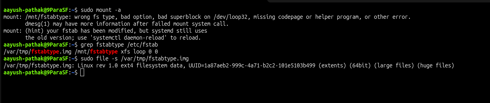
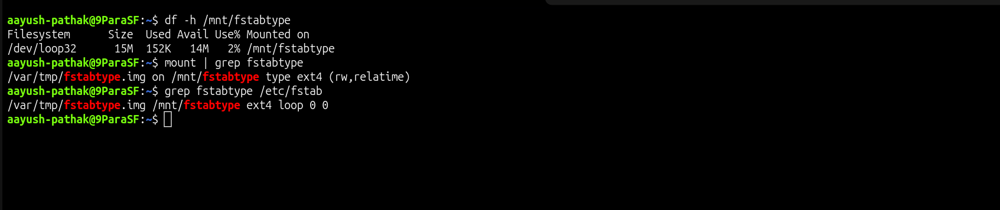

# Fstab Wrong Filesystem Type

## Incident Summary

A filesystem entry was added in `/etc/fstab`, but the filesystem type was configured incorrectly. Because of this, `mount -a` failed and the mount point did not become available.

---

## 🔴 Impact

- Mount point was not available after running `mount -a`
- Application data path could not be mounted
- The server showed an fstab mount failure
- Manual verification was needed before considering the issue fixed

---

## 🧪 Symptom

The mount command failed because the filesystem type in `/etc/fstab` did not match the actual filesystem on the disk image.

```bash
sudo mount -a
```

Example error:

```text
mount: /mnt/fstabtype: wrong fs type, bad option, bad superblock on /dev/loop0, missing codepage or helper program, or other error.
```

---

## 🖼️ Screenshot - Wrong Filesystem Type



---

## 🔍 Investigation

The fstab entry was checked first.

```bash
grep fstabtype /etc/fstab
```

Output showed that the mount was configured with the wrong filesystem type.

```text
/var/tmp/fstabtype.img /mnt/fstabtype xfs loop 0 0
```

The actual filesystem on the image file was checked.

```bash
sudo file -s /var/tmp/fstabtype.img
```

The output showed that the image was formatted as `ext4`, but `/etc/fstab` was configured with `xfs`.

---

## 🎯 Root Cause

The `/etc/fstab` entry had the wrong filesystem type.

The disk image was formatted as `ext4`, but the fstab entry was configured as `xfs`.

---

## ✅ Fix Applied

The fstab entry was corrected from `xfs` to `ext4`.

```bash
sudo sed -i 's|/var/tmp/fstabtype.img /mnt/fstabtype xfs loop 0 0|/var/tmp/fstabtype.img /mnt/fstabtype ext4 loop 0 0|' /etc/fstab
sudo systemctl daemon-reload
sudo mount -a
```

---

## ✅ Verification

The mount point was checked again after correcting the fstab entry.

```bash
df -h /mnt/fstabtype
```

Expected result:

```text
Filesystem      Size  Used Avail Use% Mounted on
/dev/loop0       20M   ...   ...  ... /mnt/fstabtype
```

The active mount was also verified.

```bash
mount | grep fstabtype
```

---

## 🖼️ Screenshot - Filesystem Type Fixed



---

## 🧰 Commands Used

```bash
sudo cp /etc/fstab /etc/fstab.bak.fstabtype
sudo sed -i '/fstabtype/d' /etc/fstab
sudo mkdir -p /mnt/fstabtype
sudo dd if=/dev/zero of=/var/tmp/fstabtype.img bs=1M count=20
sudo mkfs.ext4 -F /var/tmp/fstabtype.img
echo '/var/tmp/fstabtype.img /mnt/fstabtype xfs loop 0 0' | sudo tee -a /etc/fstab
sudo mount -a
grep fstabtype /etc/fstab
sudo file -s /var/tmp/fstabtype.img
sudo sed -i 's|/var/tmp/fstabtype.img /mnt/fstabtype xfs loop 0 0|/var/tmp/fstabtype.img /mnt/fstabtype ext4 loop 0 0|' /etc/fstab
sudo systemctl daemon-reload
sudo mount -a
df -h /mnt/fstabtype
mount | grep fstabtype
```

---

## 🧠 Key Learning

- `/etc/fstab` must match the real filesystem type
- A wrong filesystem type can stop a mount from working
- `mount -a` is useful for safely testing fstab changes
- `file -s` helps confirm the actual filesystem type
- Always verify the mount after editing `/etc/fstab`

---

## Final Result

The fstab filesystem type was corrected and the mount point became available again.

```text
/var/tmp/fstabtype.img mounted successfully on /mnt/fstabtype
```
