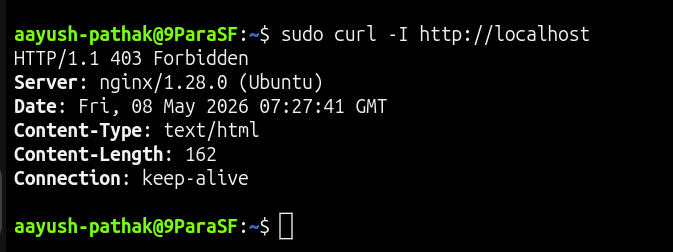
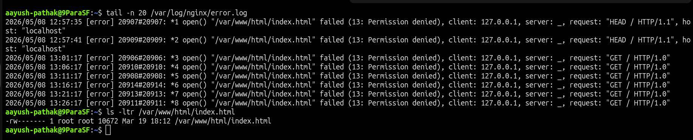
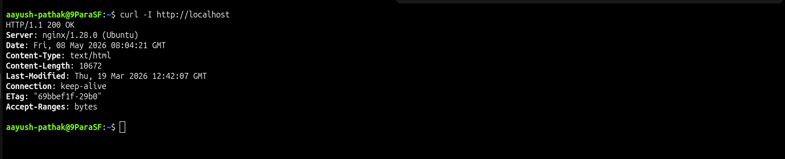

# 🌐 Nginx 403 Forbidden - File Permission Issue

## Incident Summary

Nginx service was running, but the website returned `403 Forbidden` when accessed from the server using `localhost`.

The issue was caused by incorrect file permission on the default Nginx index file:

    /var/www/html/index.html

Nginx was able to receive the HTTP request, but it could not read the index file, so it returned a forbidden response.

---

## 🔴 Impact

- Nginx service was active
- Port 80 was reachable locally
- Website content was not displayed
- Client received `403 Forbidden`
- Issue was caused by file permission, not by service failure

---

## 🧪 Symptom

Checked the local website response:

    curl -I http://localhost

Observed response:

    HTTP/1.1 403 Forbidden

This confirmed that the request reached Nginx, but Nginx could not serve the requested content.

---

## 🖼️ Screenshot - Before Fix

---

## 🔍 Investigation

Checked Nginx service status:

    systemctl status nginx

Checked the default web root directory:

    ls -ld /var/www/html

Checked the index file permission:

    ls -l /var/www/html/index.html

The index file permission was incorrect.

A normal static web file should have permission similar to:

    -rw-r--r--

This means:

- Owner can read and write
- Group can read
- Others can read

Nginx needs read permission to serve the file.

---

## 🖼️ Screenshot - Root Cause Evidence

---

## 🎯 Root Cause

The root cause was missing read permission on:

    /var/www/html/index.html

Because Nginx could not read the file, it returned:

    403 Forbidden

This was not a firewall issue, not a port issue, and not an Nginx service startup issue.

---

## ✅ Fix Applied

Corrected the file permission:

    sudo chmod 644 /var/www/html/index.html

Reloaded Nginx:

    sudo systemctl reload nginx

---

## ✅ Verification

Checked the website response again:

    curl -I http://localhost

Successful response:

    HTTP/1.1 200 OK

This confirmed that Nginx was able to read and serve the index file successfully.

---

## 🖼️ Screenshot - After Fix

---

## 🧰 Commands Used

Check Nginx service:

    systemctl status nginx

Check local HTTP response:

    curl -I http://localhost

Check web root directory permission:

    ls -ld /var/www/html

Check index file permission:

    ls -l /var/www/html/index.html

Fix file permission:

    sudo chmod 644 /var/www/html/index.html

Reload Nginx:

    sudo systemctl reload nginx

Check Nginx error logs:

    sudo tail -n 50 /var/log/nginx/error.log

---

## 🧠 Key Learning

A running service does not always mean the application is healthy.

In this issue, Nginx was active and reachable, but the web page failed because the file permission was incorrect.

For Nginx `403 Forbidden` issues, always check:

- File permission
- Directory permission
- Web root path
- Nginx configuration
- Nginx error logs
- Security restrictions such as SELinux or AppArmor if enabled

---

## Final Result

The issue was resolved after correcting the file permission on `/var/www/html/index.html`.

Final verification:

    HTTP/1.1 200 OK
