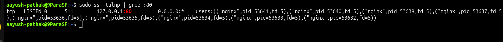
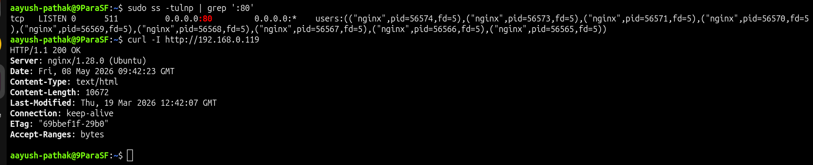

# 🌐 Nginx Listening Only on Localhost

## Incident Summary

Nginx was running and the website worked locally using `localhost`, but the website was not accessible using the server IP address.

Local access worked:

    curl -I http://localhost

Remote access failed:

    curl -I http://192.168.0.119

The issue happened because Nginx was listening only on the loopback address:

    127.0.0.1:80

This means Nginx accepted requests only from the same server and did not listen on the server network interface.

---

## 🔴 Impact

- Nginx service was running
- Local access using `localhost` worked
- Remote access using server IP failed
- Port 80 was not open on all IPv4 interfaces
- Users outside the server could not access the website

---

## 🧪 Symptom

Local test worked:

    curl -I http://localhost

Successful local response:

    HTTP/1.1 200 OK
    Server: nginx

Remote test using server IP failed:

    curl -I http://192.168.0.119

Observed error:

    Failed to connect to 192.168.0.119 port 80

---

## 🖼️ Screenshot - Remote Access Failed

---

## 🔍 Investigation

Checked Nginx listening address:

    sudo ss -tulnp | grep ':80'

Observed output showed Nginx listening only on:

    127.0.0.1:80

This confirmed that Nginx was bound only to localhost.

Because of this, requests to the server IP address could not reach Nginx.

---

## 🖼️ Screenshot - Root Cause Evidence

---

## 🎯 Root Cause

The root cause was incorrect Nginx listen configuration.

Nginx was configured with:

    listen 127.0.0.1:80 default_server;

This allowed only local connections.

For remote access, Nginx should listen on all IPv4 interfaces:

    listen 0.0.0.0:80 default_server;

or:

    listen 80 default_server;

---

## ✅ Fix Applied

Updated the Nginx site configuration from:

    listen 127.0.0.1:80 default_server;

to:

    listen 0.0.0.0:80 default_server;

Validated Nginx configuration:

    sudo nginx -t

Reloaded Nginx:

    sudo systemctl reload nginx

---

## ✅ Verification

Checked listening address again:

    sudo ss -tulnp | grep ':80'

Expected result:

    0.0.0.0:80

Verified local access:

    curl -I http://localhost

Verified access using server IP:

    curl -I http://192.168.0.119

Successful response:

    HTTP/1.1 200 OK
    Server: nginx

---

## 🖼️ Screenshot - Remote Access Working

---

## 🧰 Commands Used

Check local response:

    curl -I http://localhost

Check server IP response:

    curl -I http://192.168.0.119

Check listening address:

    sudo ss -tulnp | grep ':80'

Edit Nginx configuration:

    sudo vim /etc/nginx/sites-available/localhost-only-lab.conf

Validate Nginx configuration:

    sudo nginx -t

Reload Nginx:

    sudo systemctl reload nginx

---

## 🧠 Key Learning

When `localhost` works but server IP access fails, check the service listening address.

If Nginx is listening only on `127.0.0.1`, it will only accept local connections.

For remote access, Nginx must listen on the server network interface or all IPv4 interfaces.

---

## Final Result

Remote access was restored after changing Nginx from localhost-only binding to all IPv4 interfaces.

Final verification:

    HTTP/1.1 200 OK
