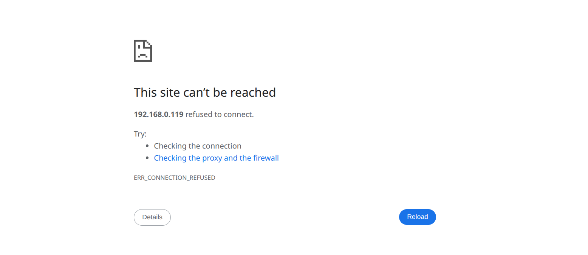
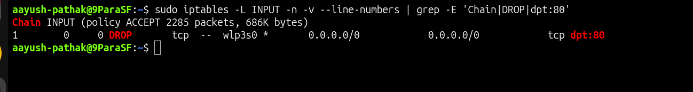
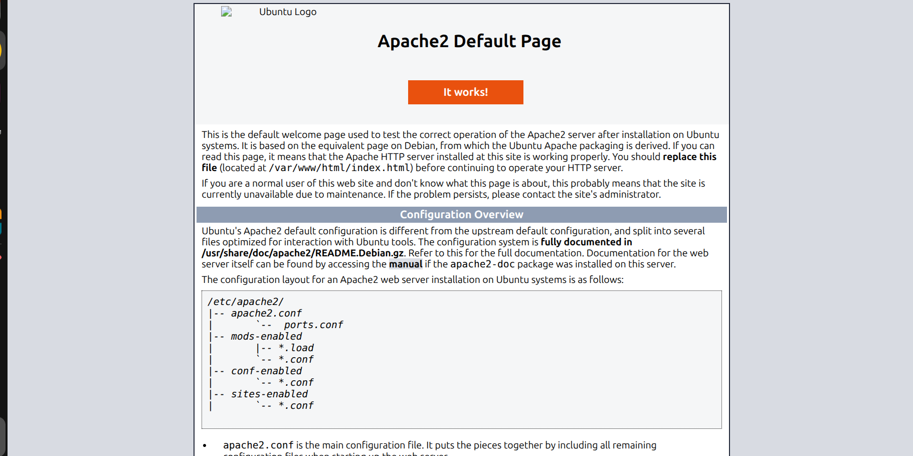

# 🌐 Nginx Localhost Works but Remote Access Fails

## Incident Summary

Nginx was running successfully and the website was accessible from the server using `localhost`.

However, the same website was not accessible from another machine using the server IP address.

This confirmed that Nginx itself was working locally, but remote HTTP traffic was not reaching the service.

---

## 🔴 Impact

- Nginx service was active
- Local website access worked on the server
- Remote users could not access the website
- Port 80 traffic was blocked before reaching Nginx
- Issue was caused by firewall filtering, not by Nginx service failure

---

## 🧪 Symptom

Local test from the server worked:

    curl -I http://localhost

Expected local response:

    HTTP/1.1 200 OK

Remote test from another machine failed:

    http://<server-ip>

This showed that the web server was healthy locally, but remote access was blocked.

---

## 🖼️ Screenshot - Remote Access Failing

---

## 🔍 Investigation

Checked Nginx service status:

    systemctl status nginx

Checked if Nginx was listening on port 80:

    ss -tulnp | grep :80

Checked the server IP address:

    hostname -I

Checked local HTTP response:

    curl -I http://localhost

Checked firewall rules:

    sudo iptables -L INPUT -n -v --line-numbers

The firewall rule showed that inbound HTTP traffic on port 80 was being dropped.

---

## 🖼️ Screenshot - Firewall Root Cause

---

## 🎯 Root Cause

The root cause was a firewall rule blocking inbound TCP traffic on port 80.

Nginx was running correctly, but remote requests could not reach it because HTTP traffic was blocked at the firewall layer.

This was not an Nginx configuration issue.

---

## ✅ Fix Applied

Removed the firewall rule blocking HTTP traffic on port 80:

    sudo iptables -D INPUT -i <interface-name> -p tcp --dport 80 -j DROP

After removing the rule, remote traffic was allowed to reach Nginx.

---

## ✅ Verification

Verified local access:

    curl -I http://localhost

Verified remote access from another machine:

    http://<server-ip>

Successful response:

    HTTP/1.1 200 OK

---

## 🖼️ Screenshot - Remote Access Working

---

## 🧰 Commands Used

Check Nginx service:

    systemctl status nginx

Check local response:

    curl -I http://localhost

Check server IP:

    hostname -I

Check listening port:

    ss -tulnp | grep :80

Check firewall rules:

    sudo iptables -L INPUT -n -v --line-numbers

Add test firewall block:

    sudo iptables -I INPUT 1 -i <interface-name> -p tcp --dport 80 -j DROP

Remove firewall block:

    sudo iptables -D INPUT -i <interface-name> -p tcp --dport 80 -j DROP

---

## 🧠 Key Learning

When a service works on `localhost` but fails remotely, the service is usually running correctly.

The issue is often in one of these layers:

- Firewall rule
- Listening address
- Network route
- Security group
- Server IP mismatch
- External network access

Always compare local access and remote access before changing the application configuration.

---

## Final Result

Nginx remote access was restored after removing the firewall rule blocking inbound HTTP traffic on port 80.
