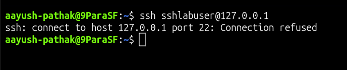
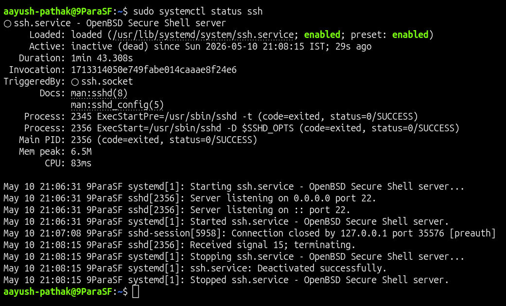

# 🔌 SSH Connection Refused - SSH Service Down

## Incident Summary

SSH connection failed with a `Connection refused` error.

The server was reachable, but SSH access was unavailable because the SSH service was not running and port `22` was not listening.

This scenario demonstrates how to troubleshoot SSH service availability using `systemctl`, port checks, and successful login verification.

---

## 🔴 Impact

- SSH login failed
- Remote shell access was unavailable
- Port `22` was not accepting connections
- SSH service was stopped
- Server administration through SSH was blocked

---

## 🧪 Symptom

SSH connection failed while connecting to the local lab server:

    ssh sshlabuser@127.0.0.1

The client returned:

    ssh: connect to host 127.0.0.1 port 22: Connection refused

---

## 🖼️ Screenshot - SSH Connection Refused

---

## 🔍 Investigation

Checked the SSH service status:

    sudo systemctl status ssh --no-pager

Checked whether port `22` was listening:

    sudo ss -tlnp | grep ':22'

The SSH service was not running and no process was listening on port `22`.

---

## 🖼️ Screenshot - Root Cause Evidence

---

## 🎯 Root Cause

The root cause was that the SSH service was stopped.

Because the service was not running, the server had nothing listening on port `22`, so SSH clients received a `Connection refused` error.

This was not a username issue, password issue, or firewall issue.

---

## ✅ Fix Applied

Started the SSH service:

    sudo systemctl start ssh

Verified service status:

    sudo systemctl status ssh --no-pager

Verified that port `22` was listening:

    sudo ss -tlnp | grep ':22'

Retried SSH login using the same local user:

    ssh sshlabuser@127.0.0.1

---

## ✅ Verification

SSH login succeeded after starting the service:

    ssh sshlabuser@127.0.0.1

Successful result:

    sshlabuser

---

## 🖼️ Screenshot - SSH Service Restored

---

## 🧰 Commands Used

Stop SSH service to create the lab issue:

    sudo systemctl stop ssh

Test SSH connection:

    ssh sshlabuser@127.0.0.1

Check SSH service status:

    sudo systemctl status ssh --no-pager

Check port `22`:

    sudo ss -tlnp | grep ':22'

Start SSH service:

    sudo systemctl start ssh

Verify SSH service:

    sudo systemctl status ssh --no-pager

Verify port `22` is listening:

    sudo ss -tlnp | grep ':22'

Verify SSH login:

    ssh sshlabuser@127.0.0.1

---

## 🧠 Key Learning

When SSH shows `Connection refused`, first check whether the SSH service is running and whether port `22` is listening.

For SSH connection refused issues, always check:

- SSH service status
- port `22` listening state
- firewall rules
- server IP / hostname
- SSH daemon configuration
- logs if the service fails to start

---

## Final Result

SSH access was restored after starting the SSH service.

Final verification:

    sshlabuser
