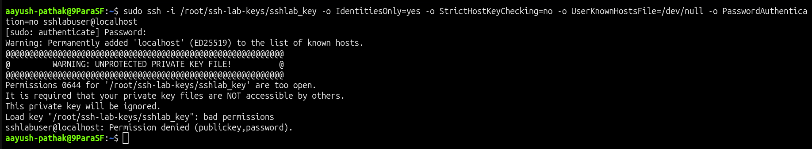
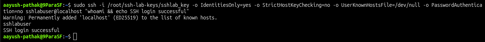

# 🔐 SSH Permission Denied - Publickey

## Incident Summary

SSH login failed with a `Permission denied (publickey)` error.

The server was reachable, but authentication failed because the SSH private key on the client side had insecure file permissions.

This scenario demonstrates a common Linux SSH issue where the SSH client refuses to use a private key if the key file is accessible by other users.

---

## 🔴 Impact

- SSH login failed
- Remote shell access was unavailable
- Public key authentication did not complete
- The server was reachable, but authentication was blocked
- Issue was caused by insecure private key permissions

---

## 🧪 Symptom

SSH login failed while connecting with a private key:

    ssh -i /root/ssh-lab-keys/sshlab_key sshlabuser@localhost

The client rejected the key and returned:

    Permission denied (publickey)

---

## 🖼️ Screenshot - SSH Permission Denied

---

## 🔍 Investigation

Checked the private key file permissions:

    ls -l /root/ssh-lab-keys/sshlab_key

The private key was readable by other users:

    -rw-r--r--

SSH private keys must not be accessible by group or other users.

Because the key permissions were too open, the SSH client ignored the key during authentication.

---

## 🎯 Root Cause

The root cause was incorrect permission on the SSH private key file.

The private key had permission `0644`, which allowed other users to read the file.

OpenSSH protects private keys by refusing to use keys with unsafe permissions.

This was not a network issue, SSH service issue, or firewall issue.

---

## ✅ Fix Applied

Changed the private key permission to allow access only to the owner:

    chmod 600 /root/ssh-lab-keys/sshlab_key

Verified the permission:

    ls -l /root/ssh-lab-keys/sshlab_key

Expected permission:

    -rw-------

Retried SSH login using the same private key.

---

## ✅ Verification

SSH authentication succeeded after fixing the private key permission:

    ssh -i /root/ssh-lab-keys/sshlab_key sshlabuser@localhost

Verified the logged-in user:

    whoami

Successful result:

    sshlabuser

---

## 🖼️ Screenshot - SSH Login Successful

---

## 🧰 Commands Used

Create lab user:

    sudo useradd -m -s /bin/bash sshlabuser

Create SSH key pair:

    ssh-keygen -t ed25519 -f /root/ssh-lab-keys/sshlab_key -N "" -C "sshlab-key"

Configure authorized key:

    sudo mkdir -p /home/sshlabuser/.ssh
    sudo cp /root/ssh-lab-keys/sshlab_key.pub /home/sshlabuser/.ssh/authorized_keys
    sudo chown -R sshlabuser:sshlabuser /home/sshlabuser/.ssh
    sudo chmod 700 /home/sshlabuser/.ssh
    sudo chmod 600 /home/sshlabuser/.ssh/authorized_keys

Create the issue:

    chmod 644 /root/ssh-lab-keys/sshlab_key

Test SSH login:

    ssh -i /root/ssh-lab-keys/sshlab_key sshlabuser@localhost

Check private key permission:

    ls -l /root/ssh-lab-keys/sshlab_key

Fix private key permission:

    chmod 600 /root/ssh-lab-keys/sshlab_key

Verify SSH login:

    ssh -i /root/ssh-lab-keys/sshlab_key sshlabuser@localhost "whoami"

---

## 🧠 Key Learning

SSH private keys must be protected with strict file permissions.

If a private key is readable by group or other users, OpenSSH may ignore the key and authentication can fail.

For SSH public key issues, always check:

- correct username
- correct private key
- private key permissions
- `authorized_keys` file
- `.ssh` directory permissions
- SSH service status
- authentication error output

---

## Final Result

SSH login succeeded after changing the private key permission to `600`.

Final verification:

    sshlabuser
