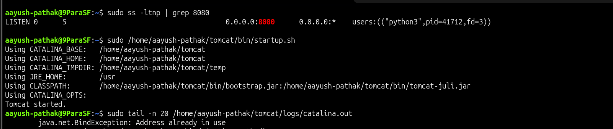
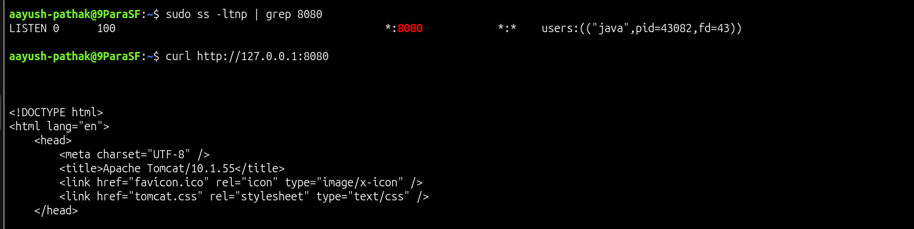

# Tomcat Port Conflict

## Incident Summary

Tomcat failed to start correctly because another process was already using port `8080`.

---

## 🔴 Impact

- Tomcat application was not available on the expected port
- Users could not access the application through `http://127.0.0.1:8080`
- Startup script was executed, but Tomcat could not bind to the HTTP port

---

## 🧪 Symptom

Tomcat was started, but the application did not respond correctly because port `8080` was already occupied.

```bash
/home/aayush-pathak/tomcat/bin/startup.sh
curl http://127.0.0.1:8080
```

Tomcat logs showed a port binding issue.

```text
Address already in use
```

---

## 🖼️ Screenshot - Tomcat Port Conflict



---

## 🔍 Investigation

Checked which process was listening on port `8080`.

```bash
ss -ltnp | grep 8080
```

Checked the test process that was occupying the port.

```bash
ps -p $(cat /tmp/tomcat-portlab.pid) -f
```

Checked Tomcat logs for the startup error.

```bash
tail -n 50 /home/aayush-pathak/tomcat/logs/catalina.out
```

The investigation showed that another process was already listening on port `8080`, so Tomcat could not use the same port.

---

## 🎯 Root Cause

A test Python HTTP server was already running on port `8080`.

Because Tomcat also uses port `8080` by default, Tomcat failed to bind to the port.

---

## ✅ Fix Applied

Stopped the process that was using port `8080`.

```bash
kill $(cat /tmp/tomcat-portlab.pid)
```

Stopped any partially started Tomcat process and started Tomcat again.

```bash
/home/aayush-pathak/tomcat/bin/shutdown.sh
/home/aayush-pathak/tomcat/bin/startup.sh
```

---

## ✅ Verification

Checked that port `8080` was listening again.

```bash
ss -ltnp | grep 8080
```

Verified that Tomcat responded successfully.

```bash
curl -s http://127.0.0.1:8080 | grep -o 'Apache Tomcat/[^<]*' | head -1
```

Expected output:

```text
Apache Tomcat/10.1.55
```

---

## 🖼️ Screenshot - Tomcat Port Conflict Fixed



---

## 🧰 Commands Used

```bash
/home/aayush-pathak/tomcat/bin/shutdown.sh
python3 -m http.server 8080
echo $!
/home/aayush-pathak/tomcat/bin/startup.sh
ss -ltnp | grep 8080
ps -p $(cat /tmp/tomcat-portlab.pid) -f
tail -n 50 /home/aayush-pathak/tomcat/logs/catalina.out
kill $(cat /tmp/tomcat-portlab.pid)
curl -s http://127.0.0.1:8080 | grep -o 'Apache Tomcat/[^<]*' | head -1
```

---

## 🧠 Key Learning

- Tomcat uses port `8080` by default
- Only one process can listen on the same port at a time
- A startup script message alone does not confirm that the application is healthy
- Always verify the listening port and check Tomcat logs
- Port conflict issues are common in application startup troubleshooting

---

## Final Result

Tomcat started successfully after freeing port `8080`.

```text
Apache Tomcat/10.1.55
```
