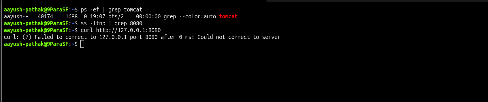
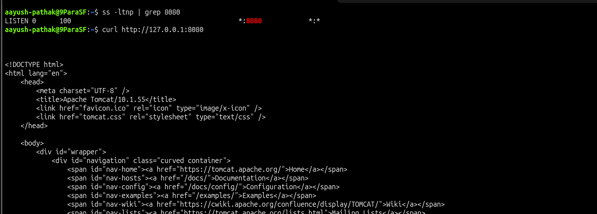

# Tomcat Service Not Running

## Incident Summary

Tomcat web application was not reachable because the Tomcat process was stopped and port `8080` was not listening.

---

## 🔴 Impact

- Application URL was not opening
- Users could not access the Tomcat default page
- Port `8080` was not accepting connections
- The issue affected application availability

---

## 🧪 Symptom

The application endpoint failed when tested locally.

```bash
curl http://127.0.0.1:8080
```

Output:

```text
curl: (7) Failed to connect to 127.0.0.1 port 8080: Connection refused
```

---

## 🖼️ Screenshot - Tomcat Service Not Running



---

## 🔍 Investigation

Checked whether Tomcat was running.

```bash
ps -ef | grep tomcat
```

Checked whether port `8080` was listening.

```bash
ss -ltnp | grep 8080
```

No active Tomcat process was found and port `8080` was not listening.

---

## 🎯 Root Cause

Tomcat was stopped, so the HTTP connector on port `8080` was not available.

---

## ✅ Fix Applied

Started Tomcat using the startup script.

```bash
/home/aayush-pathak/tomcat/bin/startup.sh
```

---

## ✅ Verification

Verified that Tomcat was listening on port `8080`.

```bash
ss -ltnp | grep 8080
```

Verified the application response.

```bash
curl http://127.0.0.1:8080
```

Expected result:

```text
Apache Tomcat/10.1.55
```

---

## 🖼️ Screenshot - Tomcat Service Fixed



---

## 🧰 Commands Used

```bash
/home/aayush-pathak/tomcat/bin/shutdown.sh
ps -ef | grep tomcat
ss -ltnp | grep 8080
curl http://127.0.0.1:8080
/home/aayush-pathak/tomcat/bin/startup.sh
```

---

## 🧠 Key Learning

- A connection refused error means the server process may not be listening on the target port
- `ss -ltnp` is useful for checking listening ports
- `ps -ef` helps confirm whether the Tomcat process is running
- For tar-based Tomcat installation, startup and shutdown scripts are used instead of `systemctl`
- Always verify both the process status and HTTP response after fixing the issue

---

## Final Result

Tomcat was started successfully and the application responded on port `8080`.

```text
Apache Tomcat/10.1.55
```
